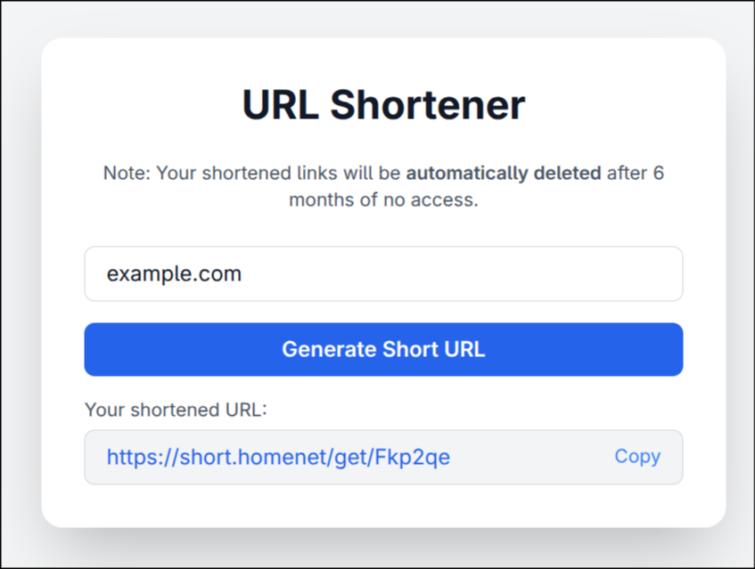
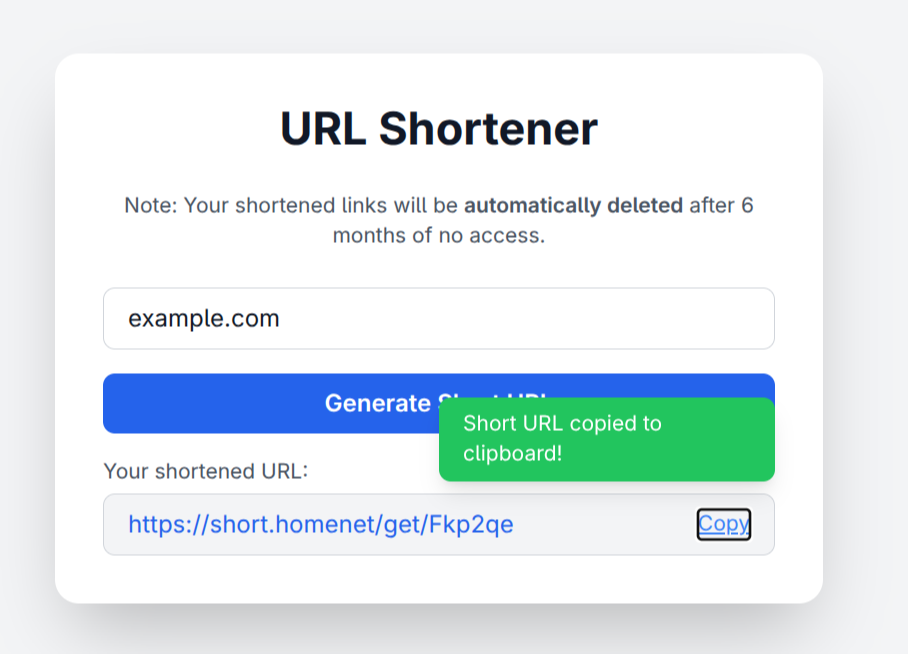

# URL Shortener

A simple, self-hosted URL shortener built with [Flask](https://flask.palletsprojects.com/), using SQLite for storage and supporting HTTPS via TLS certificates.

## Features

- Shorten long URLs to simple codes (e.g., `https://yourdomain/get/abc123`)
- All data stored locally in a lightweight SQLite database
- HTTPS support with configurable TLS certificates
- Expiry policy: Links are automatically deleted after 6 months of inactivity (planned, not yet implemented)

## Requirements

- Python 3.8+
- [pip](https://pip.pypa.io/en/stable/)
- TLS certificate and key files (`cert.pem`, `key.pem`)

All Python dependencies are listed in [`requirements.txt`](requirements.txt):

## Configuration

Configuration is managed via a `.env` file in the project root. Example:
- `DB_FILE`: Path to the SQLite database file.
- `SERVER_PORT`: Port to run the server on.
- `TLS_CERT_FILE`: Path to your TLS certificate file. (optional)
- `TLS_KEY_FILE`: Path to your TLS private key file. (optional)
- `ADDRESS_RESOLUTION`: Host/IP to bind the server (e.g., `127.0.0.1` for local, `0.0.0.0` for all interfaces).

## TLS Configuration

To enable HTTPS, you must provide valid TLS certificate and key files (`cert.pem`, `key.pem`). You can generate self-signed certificates for testing: Update your `.env` to point to these files.

### Template to create TLS keys and certs

```
openssl req -x509 -sha256 -nodes -newkey rsa:<key_length> -days <nr> -CA <CA_cert_file> -CAkey <CA_key_file> -keyout <server_key_file> -out <server_cert_file> -subj "/C=XX/ST=Y/O=Z/CN=<dns_name>" -addext "basicConstraints=critical,CA:FALSE" -addext "subjectAltName = DNS:<dns_name>"
```

CA and Cakey are optional

## Usage

1. Install dependencies:

    ```
    pip install -r requirements.txt
    ```

2. Create and configure your `.env` file as shown above.

3. Run the application:

    ```
    python3 app.py
    ```

4. Open your browser and navigate to `https://localhost:8080` (or your configured address/port).

## Database

This project uses SQLite for simplicity. The database file is created automatically (see `DB_FILE` in `.env`). The schema is initialized on first run.

## Showcase

