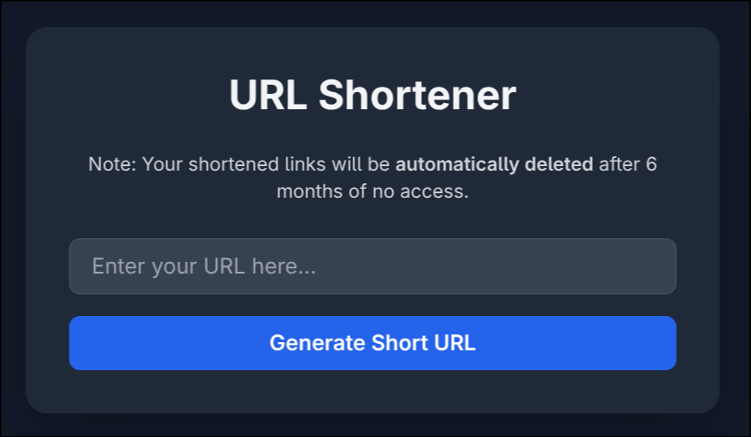
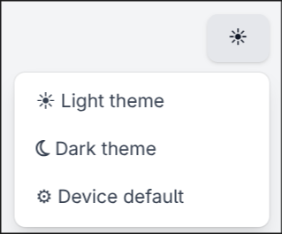
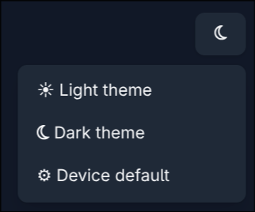

# URL Shortener

A simple, self-hosted URL shortener built with [Flask](https://flask.palletsprojects.com/), using SQLite for storage and supporting HTTPS via TLS certificates.

## Features

- Shorten long URLs to simple codes (e.g., `https://yourdomain/abc123`)
- All data stored locally in a lightweight SQLite database
- HTTPS support with configurable TLS certificates
- Expiry policy: Links are automatically deleted after 6 months of inactivity (planned, not yet implemented)

## Requirements

- Python 3.8+
- [pip](https://pip.pypa.io/en/stable/)
- TLS certificate and key files for HTTPS (`cert.pem`, `key.pem`) (Optional)

All Python dependencies are listed in [`requirements.txt`](requirements.txt):

## Configuration

Configuration is managed via a `.env` file in the project root. Example:
- `DB_FILE`: Path to the SQLite database file.
- `SERVER_PORT`: Port to run the server on.
- `TLS_CERT_FILE`: Path to your TLS certificate file. (optional)
- `TLS_KEY_FILE`: Path to your TLS private key file. (optional)
- `ADDRESS_RESOLUTION`: Host/IP to bind the server (e.g., `127.0.0.1` for local, `0.0.0.0` for all interfaces).

## TLS Configuration

To enable HTTPS, you must provide valid TLS certificate and key files (`cert.pem`, `key.pem`). You can generate self-signed certificates for testing: Update your `.env` to point to these files.

### Template to create TLS keys and certs

```
openssl req -x509 -sha256 -nodes -newkey rsa:<key_length> -days <nr> -CA <CA_cert_file> -CAkey <CA_key_file> -keyout <server_key_file> -out <server_cert_file> -subj "/C=XX/ST=Y/O=Z/CN=<dns_name>" -addext "basicConstraints=critical,CA:FALSE" -addext "subjectAltName = DNS:<dns_name>"
```

CA and Cakey are optional

## Installation

The application can be run either with Docker or directly on your system.

### Docker

**Using Docker image:**

1. Build the Docker image:
    ```
    docker build -t urlshortener .
    ```
2. Run the container (replace `<port from .env>` with your configured port):
    ```
    docker run -itd -p 80:<port from .env> urlshortener
    ```

**Using Docker Compose (recommended):**

1. Ensure your `.env` file and any required certificate files are present.
2. Start the application:
    ```
    docker-compose up -d
    ```

### Bare Metal (Non-Docker)

1. Install dependencies:
    ```
    pip install -r requirements.txt
    ```
2. Create and configure your `.env` file as described above.
3. Run the application:
    ```
    python3 app.py
    ```
4. Open your browser and navigate to `https://localhost:<env_port>` (or your configured address/port).

## Backup and Data Migration

- **Database Backup:**  
  To back up your data, simply copy the `database.db` SQLite file. This file contains all URL mappings and related data.

- **Docker Volumes:**  
  When running with Docker, it is recommended to mount a persistent volume for `database.db` to ensure data is retained across container restarts. For example:
    ```
    docker run -itd -v <host_path>:/usr/src/app/database.db -p 80:<port from .env> urlshortener
    ```
  The provided `docker-compose.yml` in this repository is pre-configured to persist the database file automatically.

- **Migration:**  
  To migrate data to another instance, copy the `database.db` file to the new environment and ensure it is referenced correctly in the new instance's `.env` file.

# Showcase
### Light theme


### Dark theme

### Error page

### Change theme menu(both styles)



### Last note
If you're not using built-in HTTPS provided by python script remove ssl_context param in app.run() function, line 79