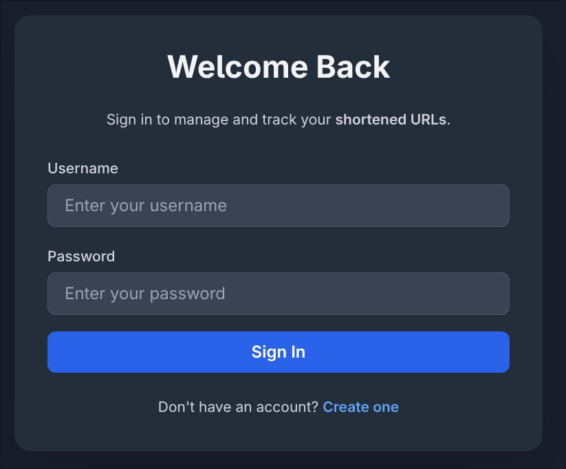
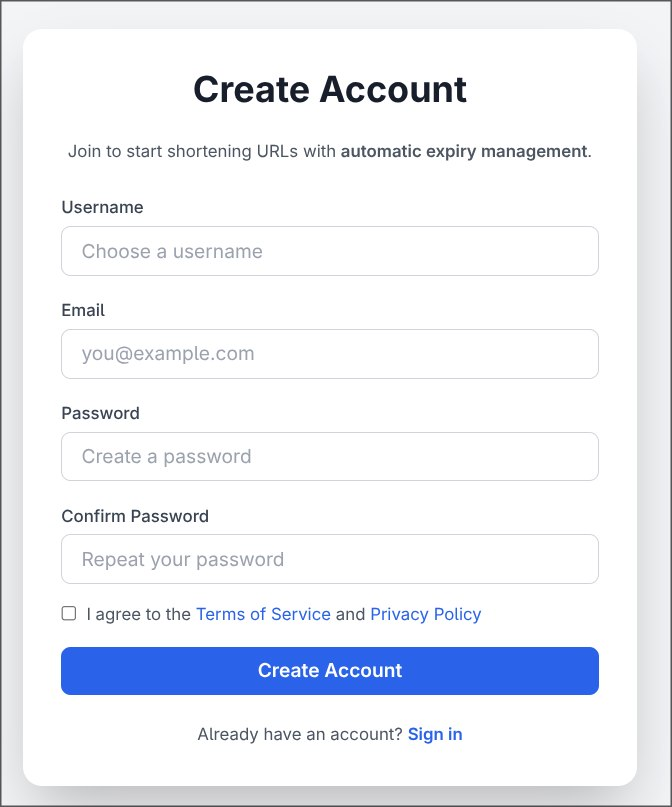
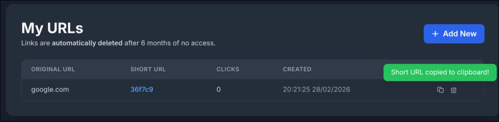
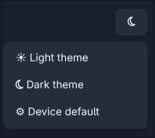

# URL Shortener

A modern, fast, and secure URL shortening service built with Go and Gin-Gonic. This project features user authentication, a dashboard for managing shortened links, and a theme-able UI.

## 🚀 Features

- **User Authentication:** Secure registration and login system.
- **URL Shortening:** Easily create short, memorable links from long URLs.
- **Analytics & Management:** Dashboard to view and delete your shortened links.
- **High Performance:** Powered by Go, with Redis for fast caching and PostgreSQL for persistent storage.
- **Modern UI:** Styled with TailwindCSS, featuring a responsive design and theme selection.
- **Dockerized:** Fully containerized setup using Docker and Docker Compose.
- **Reverse Proxy:** Nginx integration for optimized request handling.

## 🛠️ Tech Stack

- **Backend:** [Golang](https://golang.org/) (Go)
- **Web Framework:** [Gin-Gonic](https://gin-gonic.com/)
- **Database:** [PostgreSQL](https://www.postgresql.org/)
- **Cache:** [Redis](https://redis.io/)
- **Design/UI:** [TailwindCSS](https://tailwindcss.com/)
- **Infrastructure:** [Docker](https://www.docker.com/) & [Docker Compose](https://docs.docker.com/compose/)
- **Web Server:** [Nginx](https://www.nginx.com/)

## 📸 Showcase

| Login Page | Register Page |
| :---: | :---: |
|  |  |

| Dashboard | Theme Selection |
| :---: | :---: |
|  |  |

| Error Page |
| :---: |
|  |

## 📁 Project Structure

```text
├── assets/             # Project screenshots
├── controllers/        # Request handlers (User, Pages, URL logic)
├── models/             # Database schemas and models
├── routes/             # API and Page routing
├── services/           # Business logic (DB, Redis, Auth)
├── static/             # CSS and JavaScript files
├── templates/          # HTML templates
├── Dockerfile          # Application container configuration
└── docker-compose.yaml # Multi-container orchestration
```

## ⚙️ Getting Started

### Prerequisites

- [Docker](https://www.docker.com/get-started)
- [Docker Compose](https://docs.docker.com/compose/install/)

### Deployment with Docker

1. **Clone the repository:**
   ```bash
   git clone <repository-url>
   cd url_shortener
   ```

2. **Configure environment variables:**
   Create a `.env` file in the root directory and add your PostgreSQL and application configurations:
   ```env
   # env for postgres
   POSTGRES_USER=your_user
   POSTGRES_PASSWORD=your_password
   POSTGRES_DB=url_shortener

   # env for the actual appplication
   REDIS_URL=
   DB_HOST=
   DB_PORT=
   DB_USER=
   DB_PASS=
   DB_NAME=
   # Add any other required variables
   ```

3. **Build and run the project:**
   ```bash
   docker-compose up -d
   ```

The application will be available at `http://localhost`.

## 📄 License

This project is licensed under the MIT License - see the [LICENSE](LICENSE) file for details.
